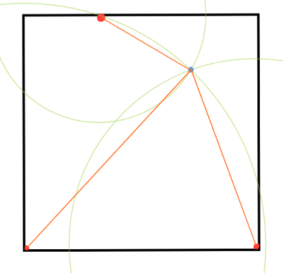

# Eindwerk

# Idee

Een bluetooth detectie systeem.

## Modules

### Master module

Deze module zal bestaan uit een [Raspberry Pi 3] samen met een [7-segment display] die het aantal beschikbare bluetooth apparaten zal weergeven. Daarnaast heb je ook een [LCD scherm] die een naam van een beschikbaar toestel weergeeft, naast deze display heb je 2 [knop]pen die dienen om het volgende beschikbare toestel op de display te zetten. 
Deze zal een webserver hebben waar je de rpi kan configureren en gemakkelijk slave modules kan toevoegen. De taak van deze module is het detecteren van bluetooth toestellen en deze naar een interne of externe database sturen (MongoDB, prometheus, influxDB of nog andere).

Ook zal deze data ontvangen van een of meerdere slave modules, deze zal hij dus ook moeten ontvangen en verwerken.

Eenmaal deze data verzameld word kan deze gevisualiseerd worden met Grafana.

### Slave module

Deze module bestaat uit een [Arduino uno] die verbonden is met een bluetooth module [HC-05]. Deze module dient te kijken welke bluetooth toestellen er zijn en deze om de x aantal seconden door te sturen naar de master module via bluetooth.

## Opties

1. Systeem die alle toestellen met die zichtbaar zijn via bluetooth in een lijst zet en bijhoud op welk tijdstip die gedetecteerd werd. Als je dan te weten komt welk toestel van welke leerling is kun je deze module je aan de ingang van de school plaatsen. Zo kan je zien welke leerlingen te op tijd waren en welke te laat.
2. Je plaatst 3 van deze modules in een kamer en laat deze alle toestellen en deze hun afstand doorsturen naar een hoofdmodule. Deze kan dan berekenen waar in deze driehoek het toestel zich ongeveer bevind, op deze manier kan je je toestel terugvinden als je die verloren hebt. 
   
   In bovenstaande foto zie je 3 modules die elk hetzelfde toestel zien samen met de afstand van de module, dus ze weten het toestel ligt ergens op de licht groene circel, de master module krijgt van de 2 andere modules de afstand binnen dat het toestel van de slave modules verwijderd is. Zo kan de master module berekenen waar het toestel zicht werkelijk bevind.
3. Systeem detecteerd wanneer je in een kamer bent, die vervolgens commando stuurt naar een andere service die het licht zal aan of uit doen.

## Benodigdheden

### Master module

#### Hardware

-  [Raspberry pi 3]
-  [7-segment display]
-  [LCD scherm]

#### Software

-  Python script
-  Webserver
-  Database

### Slave moule

#### Hardware

-  [Arduino uno]
-  [HC-05] bluetooth module

#### Software

-  Ardiuno script

[//]: # "These are reference links used in the body of this note and get stripped out when the markdown processor does its job. There is no need to format nicely because it shouldn't be seen. Thanks SO - http://stackoverflow.com/questions/4823468/store-comments-in-markdown-syntax"

<!-- Raspberry pi -->

[raspberry pi 3]: https://www.google.com/search?q=raspberry+pi+3+&rlz=1C1QPHC_nlBE970BE970&ei=SBc_Y4OKK9D0kgWjuZ_wBg&ved=0ahUKEwiDzqSIl8z6AhVQuqQKHaPcB24Q4dUDCA4&uact=5&oq=raspberry+pi+3+&gs_lcp=Cgdnd3Mtd2l6EAMyBAgAEEMyBQgAEIAEMgUIABCABDIFCAAQgAQyBQgAEIAEMgUIABCABDIFCAAQgAQyBQgAEIAEMgUIABCABDIFCAAQgAQ6CggAEEcQ1gQQsAM6BggAEB4QBzoHCAAQsQMQQzoLCAAQgAQQsQMQgwFKBAhBGABKBAhGGABQ6hlYwS5gpjtoBXABeACAAbUBiAHhA5IBAzIuMpgBAKABAaABArABAMgBCMABAQ&sclient=gws-wiz&safe=active&ssui=on

<!-- Arduino -->

[arduino uno]: https://www.google.com/search?q=arduino+uno&rlz=1C1QPHC_nlBE970BE970&ei=Qx0_Y8LjMI_3kgWR7qTwDw&oq=ardui&gs_lcp=Cgdnd3Mtd2l6EAMYATIKCAAQsQMQgwEQQzIKCAAQsQMQgwEQQzIECAAQQzIECAAQQzIECAAQQzIECAAQQzIECAAQQzIKCAAQsQMQgwEQQzIECAAQQzIECAAQQzoKCAAQRxDWBBCwAzoHCAAQsAMQQzoQCC4QsQMQgwEQxwEQ0QMQQzoRCC4QgAQQsQMQgwEQxwEQ0QM6EQguEIAEELEDEMcBENEDENQCOg4ILhCABBCxAxDHARDRAzoOCC4QgAQQsQMQgwEQ1AI6CAgAEIAEELEDSgQIQRgASgQIRhgAUKoJWPwNYPMeaANwAXgAgAFziAGQBJIBAzEuNJgBAKABAcgBCsABAQ&sclient=gws-wiz&safe=active&ssui=on

<!-- Bluetooth module -->

[hc-05]: https://www.google.com/search?q=arduino+bluetooth+module+hc-05&rlz=1C1QPHC_nlBE970BE970&ei=eh0_Y8SkK8TpsAfz-6SYCA&oq=arduino+bluetooth+module.&gs_lcp=Cgdnd3Mtd2l6EAEYATIGCAAQHhAWMgYIABAeEBYyBggAEB4QFjIGCAAQHhAWMgYIABAeEBYyBggAEB4QFjIGCAAQHhAWMgYIABAeEBYyBggAEB4QFjIGCAAQHhAWOgoIABBHENYEELADOgcIABCwAxBDOgoIABCxAxCDARBDOgQIABBDOgUIABCABDoLCAAQgAQQsQMQgwFKBAhBGABKBAhGGABQ4gdYiiNg-zVoAXABeACAAXKIAd8DkgEDMy4ymAEAoAEByAEKwAEB&sclient=gws-wiz&safe=active&ssui=on

<!-- 7-segment display -->

[7-segment display]: https://www.google.com/search?q=7-segment+display&rlz=1C1QPHC_nlBE970BE970&oq=7-segme&aqs=chrome.1.69i57j0i512l9.2724j0j7&sourceid=chrome&ie=UTF-8&safe=active&ssui=on

<!-- LCD scherm -->

[lcd scherm]: https://www.google.com/search?q=LCD+scherm&rlz=1C1QPHC_nlBE970BE970&oq=LCD+scherm&aqs=chrome..69i57j0i512l9.3309j0j7&sourceid=chrome&ie=UTF-8&safe=active&ssui=on

 <!-- Button -->

[knop]: https://www.google.com/search?q=knop+arduino&rlz=1C1QPHC_nlBE970BE970&ei=kjRAY4LfNOiU9u8Pm4SF8A8&ved=0ahUKEwiC8NeRp876AhVoiv0HHRtCAf4Q4dUDCA4&uact=5&oq=knop+arduino&gs_lcp=Cgdnd3Mtd2l6EAMyBQgAEIAEMgYIABAeEBY6CggAEEcQ1gQQsAM6BwgAELADEEM6DQgAEOQCENYEELADGAE6EgguEMcBENEDEMgDELADEEMYAjoECAAQQzoICAAQsQMQgwE6CwguEIAEELEDENQCOgsIABCABBCxAxCDAToICAAQgAQQsQM6DgguEIAEEMcBEK8BENQCOgUILhCABDoLCAAQgAQQsQMQyQM6CwguEIAEEMcBEK8BOggIABAeEA8QFjoICAAQHhAWEApKBAhBGABKBAhGGAFQZVjvlg1ghZkNaAdwAXgBgAHJAYgBpg2SAQYxMS41LjGYAQCgAQHIARHAAQHaAQYIARABGAnaAQYIAhABGAg&sclient=gws-wiz&safe=active&ssui=on

